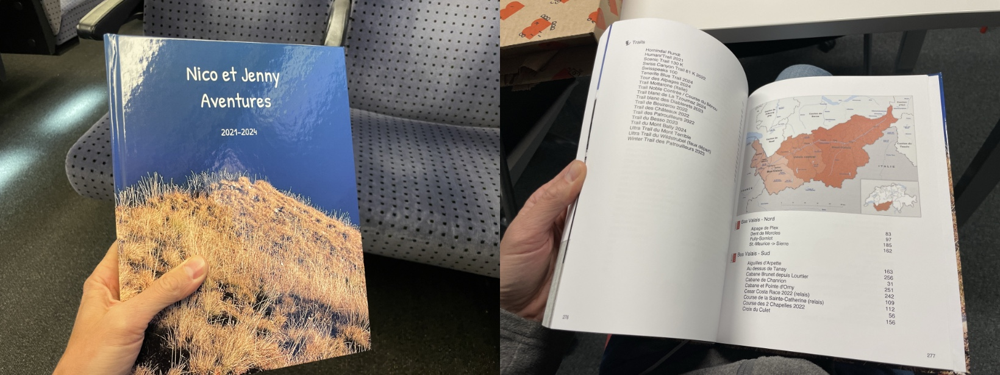
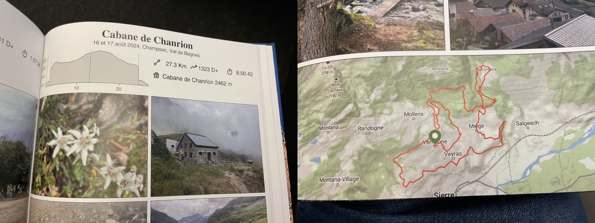

Strava Book
===========

I created a book based on our shared  [Strava](https://www.strava.com/) activities, as a gift to my partner.

The book is generated semi-automatically with the code in this repo. Beware, this is not production code, but hacky code that works on my machine instead. Feel free to use it as you wish as inspiration to generate your own books.

While this readme file is not a documentation, it explains most of what you need to know. The rest is left up to the reader :)

###  Description of the Files

    1_download_activities.py - download all your Strava activities
    2_cleanup_activities.py  - cleanup the activities
    book.py                  - main file
    config.py                - holds various parameters + API keys
    geocoding.py             - calls geocoding API
    json_utils.py            - manages JSON files
    index_creator.py         - manages book index
    map_maker.py             - calls static maps API
    page_creator.py          - created a PDF out of an activity
    elevation_chart.py       - draws the elevation chart
    elevation.py             - gets elevations data out of polylines
    icons/                   - various SVG icons used in the book
    images/                  - various PNG images used in the book
    polyline_decoder.py      - converts polyline into coordinates
    pages/                   - one folder per page
    
    pages/ACTIVITY_ID/
        _meta_.json          - hand-written activity metadata, useful for indexing and customizing contents
                            {
                                "Titre": "",
                                "Sommets": [],
                                "Cabanes": [],
                                "Region": "Bas Valais - Sud",
                                "Comments": "Test",
                                "Course": true,
                                "Trail": true,
                                "override_date": "1-2-3 janvier 2024"
                            }
        photos/         - either 1 or 4 photos, named 1.jpg, 2.jpg, etc

### 1. Download your activities

    python3 1_download_activities.py

### 2. Cleanup Strava data

    python3 2_cleanup_activities.py

### 3. Generate the book

Generating the book is an incremental process.

Essentially, `book.py` will parse `activities_ids.json` and build one page per list of activities.

`book.py` can be used with options, depending on what you want to achieve.

    python3 book.py
        -s --sequential       Sequential (no parallelism)
        -t --use_test_data    Use a subset of activities (activities_ids_test.json)
        -i --index_only       Generate only index
        -c --cache_for_pages  Don't regenerate existing pages
        -o --open             Open result file (PDF)
        -p --page             Open activity for page
        -d --directory        Open directory

Pages directories are generated based on, either:
* a single activity id
* several merged activity ids
* a string, designating a directory with a full page photo

Sample `activities_ids.json`

        [
            [6706720434, 6706941227],       # activities to be merged
            [6726577929],                   # single activity
            [6735743335],                   # single activity
            [6740294797],                   # single activity
            ["mont_blanc"]                  # full page photo
        ]

You typically want to customize the pages by editing `_meta_.json` and `photos/`, and regenerate the pages when done.

I used MapTiler for mapping and geo-coding APIs and Stadia for the elevation API. API keys live in `config.json`.

### 4. PDF post-processing for print

    gs -o book_print.pdf -sDEVICE=pdfwrite -dEmbedAllFonts=true -dPDFSETTINGS=/prepress -dDownsampleColorImages=false -dDownsampleGrayImages=false -dDownsampleMonoImages=false -dColorImageResolution=300 -dGrayImageResolution=300 -dMonoImageResolution=1200 book.pdf

### 5. Upload the book and create the cover

See https://pdf-to-book.bookfactory.ch
